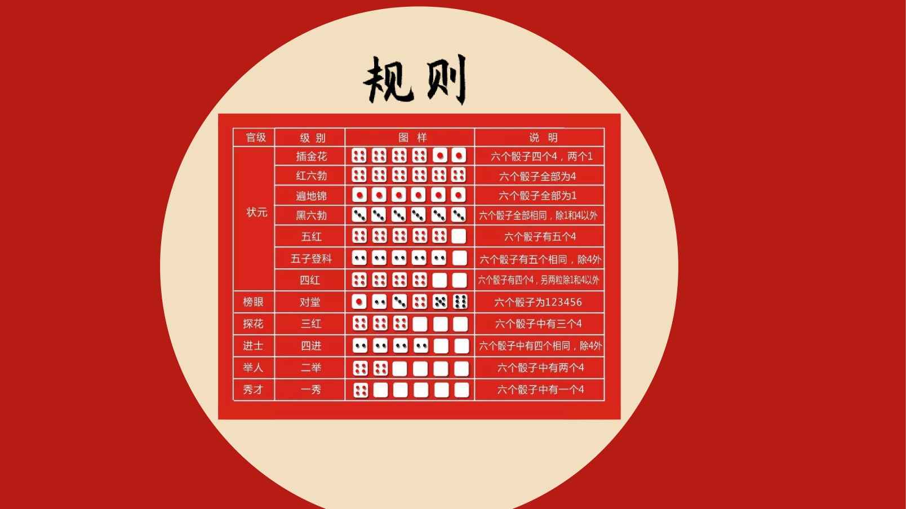
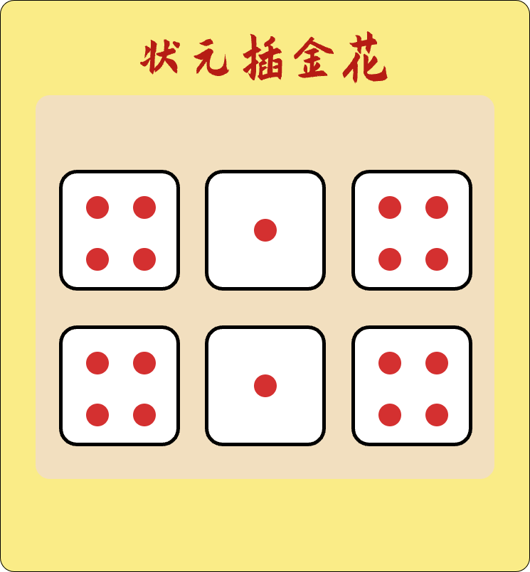
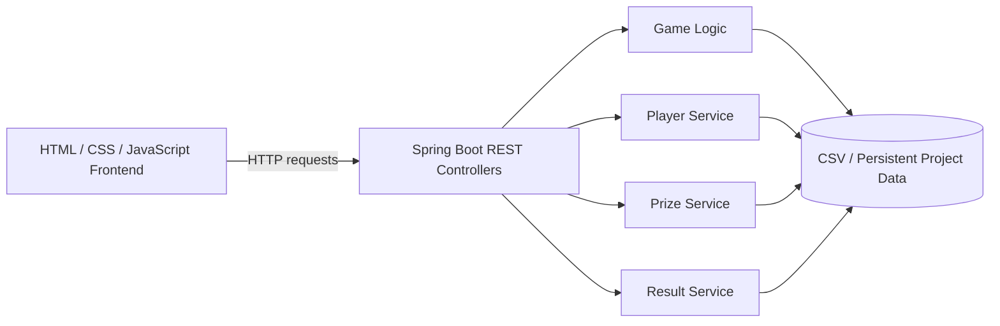
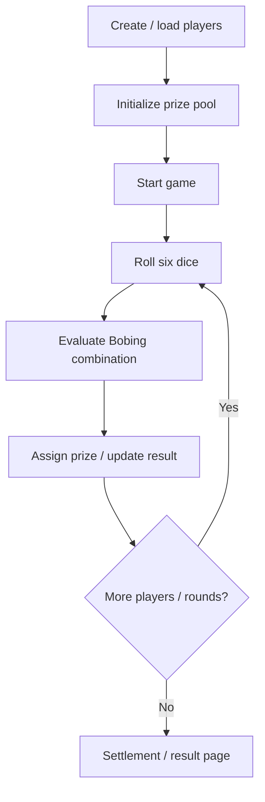

<div align="center">

# Bobing
### EE308 Full-Stack Mid-Autumn Dice Game Project


</div>

## Overview

**Bobing (博饼)** is a collaborative software-engineering project developed for **EE308 Lab 2**. It implements the traditional Fujian Mid-Autumn Festival dice game as a web application, with a Spring Boot backend for players, game logic, prizes and results, together with a custom frontend containing game pages, rule illustrations, dice assets and result screens.

## Team

- **Frontend:** Rongzeng Su
- **Backend:** Bo Liu

The project is presented as a collaborative implementation; the frontend and backend responsibilities are kept explicit throughout the repository.

## UI Preview

<p align="center">
  
  
</p>

<p align="center">
  
  
</p>

<p align="center"><em>Representative UI and prize assets included in the original project.</em></p>

## Architecture



## Backend APIs

The backend contains several dedicated REST controllers:

| Controller | Base path | Responsibility |
| --- | --- | --- |
| `GameController` | `/game` | Core Bobing game flow and dice/game-state logic |
| `PlayerController` | `/player` | Player management |
| `PrizeController` | `/prize` | Prize configuration / access |
| `ResultController` | `/result` | Game result management |
| `DataController` | utility/reset endpoint | Reset or initialize player/result data |

The original code uses Swagger annotations for API descriptions and separates controller, entity and service responsibilities in the Spring Boot backend.

## Game Assets

The frontend contains dice and prize illustrations for the main Bobing award categories, including:

- 一秀
- 二举
- 四进
- 三红
- 对堂
- 状元
- 状元插金花
- 五红 / 五子登科
- 红六勃 / 黑六勃

The six dice-face images are also stored under `front-edge/img/` and are used by the game interface.

## Data Files

The `dataset_structure/` directory preserves lightweight game-state data:

```text
dataset_structure/
├── player.csv
├── prize.csv
└── result.csv
```

These files reflect the original course-project persistence structure for players, prize definitions and results.

## Repository Structure

```text
Bobing/
├── src/main/java/com/ee308/bobing/
│   ├── controller/             # Game/player/prize/result/data APIs
│   ├── entity/                 # Domain entities
│   └── ...                     # Backend service/configuration
├── dataset_structure/          # Original CSV data structure
├── front-edge/
│   ├── img/                    # UI, dice and prize assets
│   ├── 创建玩家界面.html
│   ├── 博饼界面.html
│   └── ...                     # Frontend pages
├── pom.xml
└── README.md
```

## Typical Game Flow



## Running

### Backend

Use the Maven wrapper or local Maven environment:

```bash
./mvnw spring-boot:run
```

On Windows:

```bat
mvnw.cmd spring-boot:run
```

### Frontend

The original frontend is stored in `front-edge/`. Open the corresponding HTML pages in the intended environment and update backend request addresses if the service host/port differs from the original course setup.

## Portfolio Context

Bobing documents early experience with **team-based software engineering, REST API design, game-state modeling, frontend/backend integration, visual asset organization, and collaborative responsibility splitting**.

## Contact

For backend-related questions, contact **Bo Liu** at `liubo317@hnu.edu.cn`.  
Homepage: https://boliupro.github.io
